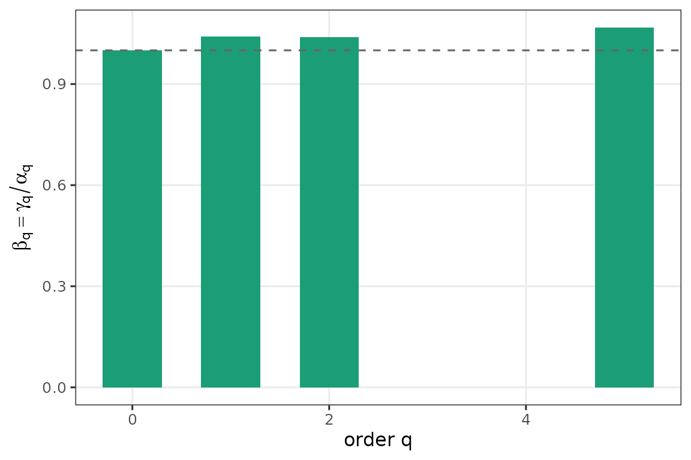

# Alpha-beta-gamma diversity over time

``` r

library(partyscape)
```

Multiplicative beta diversity (Jost 2007) answers: “how many distinct
compositions is this trajectory equivalent to?” A country whose seat
shares drift gently has beta near 1; a country with genuinely different
elections has beta approaching T.

**Columns must carry party identity, not rank.** Row-sorting shares by
size (“column 1 = largest party that year”) destroys the information
beta is designed to detect — when two parties swap positions, the sorted
representation records stability while actual identity changed. Every
example below uses named, non-sorted columns.

## A stable country — Austria after 1970

Two parties dominate (SPÖ, ÖVP) with steady shares across three decades.
β should sit near 1 at every q.

``` r

austria <- rbind(
  `1986` = c(SPOE = 0.437, OEVP = 0.421, FPOE = 0.098, Gruene = 0.044),
  `1990` = c(SPOE = 0.437, OEVP = 0.328, FPOE = 0.180, Gruene = 0.055),
  `1994` = c(SPOE = 0.355, OEVP = 0.284, FPOE = 0.235, Gruene = 0.071),
  `1995` = c(SPOE = 0.388, OEVP = 0.350, FPOE = 0.224, Gruene = 0.049)
)
alpha_beta_gamma(austria, q = c(0, 1, 2, 5),
                 years = c(1986, 1990, 1994, 1995))
#> Warning: as_composition(): renormalizing rows so each sums to 1 (max deviation
#> was 0.055).
#> <beta_diversity: T = 4 rows, 4 q points>
#>  q    alpha     beta    gamma T
#>  0 4.000000 1.000000 4.000000 4
#>  1 3.296660 1.014637 3.344912 4
#>  2 3.004748 1.019008 3.061863 4
#>  5 2.713200 1.024388 2.779369 4
```

## A churning country — Germany 2002-2005-2009

Between 2002 and 2005 SPD and CDU/CSU swap as the largest party. Column
order stays constant (this is what keeps identity); only the entries
move. β₂ captures the swap.

``` r

germany <- rbind(
  `2002` = c(CDU = 0.315, CSU = 0.096, SPD = 0.416,
             FDP = 0.078, Gruene = 0.091, Linke = 0.003),
  `2005` = c(CDU = 0.293, CSU = 0.075, SPD = 0.362,
             FDP = 0.099, Gruene = 0.083, Linke = 0.088),
  `2009` = c(CDU = 0.312, CSU = 0.072, SPD = 0.235,
             FDP = 0.150, Gruene = 0.109, Linke = 0.122)
)
bd <- alpha_beta_gamma(germany, q = c(0, 1, 2, 5),
                       years = c(2002, 2005, 2009))
#> Warning: as_composition(): renormalizing rows so each sums to 1 (max deviation
#> was 0.001).
bd
#> <beta_diversity: T = 3 rows, 4 q points>
#>  q    alpha     beta    gamma T
#>  0 6.000000 1.000000 6.000000 3
#>  1 4.689208 1.040449 4.878880 3
#>  2 3.997689 1.039583 4.155931 3
#>  5 3.221741 1.067642 3.439665 3
plot(bd)
```



## What sorting would hide

To make the paper’s “sorting hides identity” point concrete: sort each
row descending, then rerun the decomposition. β collapses toward 1
because the pooled composition now averages “the k-th largest slot”
across rows, not “the share of party X.”

``` r

germany_sorted <- t(apply(germany, 1, sort, decreasing = TRUE))
colnames(germany_sorted) <- paste0("Rank_", seq_len(ncol(germany_sorted)))
alpha_beta_gamma(germany_sorted, q = c(0, 1, 2, 5),
                 years = c(2002, 2005, 2009))
#> Warning: as_composition(): renormalizing rows so each sums to 1 (max deviation
#> was 0.001).
#> <beta_diversity: T = 3 rows, 4 q points>
#>  q    alpha     beta    gamma T
#>  0 6.000000 1.000000 6.000000 3
#>  1 4.689208 1.025677 4.809613 3
#>  2 3.997689 1.020823 4.080931 3
#>  5 3.221741 1.033500 3.329670 3
```

The unsorted β at q = 2 exceeds the sorted one — exactly the
`β_unsorted ≥ β_sorted` inequality the paper proves.

## Collapsing to elections

When consecutive country-years repeat the same composition between
elections, pass `years` to weight by term length.
[`alpha_beta_gamma()`](https://mneunhoe.github.io/partyscape/reference/alpha_beta_gamma.md)
auto-collapses via
[`collapse_to_elections()`](https://mneunhoe.github.io/partyscape/reference/collapse_to_elections.md).

``` r

germany_annual <- rbind(
  `2002` = germany["2002", ],
  `2003` = germany["2002", ],   # same composition
  `2004` = germany["2002", ],   # same composition
  `2005` = germany["2005", ],
  `2006` = germany["2005", ],
  `2007` = germany["2005", ],
  `2008` = germany["2005", ],
  `2009` = germany["2009", ]
)
alpha_beta_gamma(germany_annual, q = 2, years = 2002:2009)
#> Warning: as_composition(): renormalizing rows so each sums to 1 (max deviation
#> was 0.001).
#> <beta_diversity: T = 3 rows, 1 q points>
#>  q    alpha     beta    gamma T
#>  2 3.838372 1.023497 3.928561 3
```
