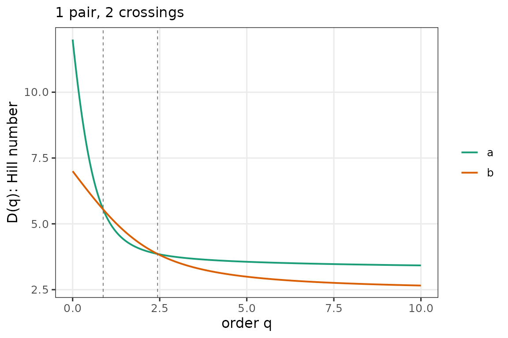

# Profile crossings: when ENP isn't enough

``` r
library(partyscape)
```

Two party systems can share an effective-number-of-parties value and yet
look nothing alike at the ends of the profile.
[`crossings()`](https://mneunhoe.github.io/partyscape/reference/crossings.md)
detects the q values where one system overtakes the other.

The example below uses the paper’s canonical case — Netherlands 1982
vs. Sweden 2002. Both have ENP near 4, but the Dutch system has many
small parties (steep profile) while Sweden has fewer, larger ones (flat
profile), so the profiles cross twice.

``` r
# Party-labeled vectors. Column order is party identity (stable, e.g.,
# alphabetical within each system), NOT rank by size.
netherlands_1982 <- c(
  PvdA = 0.313, CDA = 0.300, VVD = 0.240, D66 = 0.040,
  PSP = 0.020, CPN = 0.020, SGP = 0.020, PPR = 0.013,
  RPF = 0.013, GPV = 0.007, CP  = 0.007, DS70 = 0.007
)
sweden_2002 <- c(
  SAP = 0.415, Moderata = 0.156, Folkpartiet = 0.138,
  Kristdemokraterna = 0.096, Vansterpartiet = 0.086,
  Centerpartiet = 0.063, Miljopartiet = 0.046
)

c(enp_nl = enp(netherlands_1982), enp_se = enp(sweden_2002))
#>   enp_nl   enp_se 
#> 4.018420 4.196356

cr <- crossings(netherlands_1982, sweden_2002, q = seq(0, 10, 0.01))
cr
#> <crossings: 1 pair, method = interp>
#>  i j id_i id_j n_crossings   first_q
#>  1 2    a    b           2 0.8758609
plot(cr)
```



## Dataset-wide scans

For large comparisons, `method = "signchange"` is cheap and robust. The
rows below are draws from an asymmetric Dirichlet — a stand-in for real
party-labeled compositions; the point is that each row is a single party
system, and the
[`crossings()`](https://mneunhoe.github.io/partyscape/reference/crossings.md)
call treats each row as its own system without any sorting assumption.

``` r
set.seed(1)
many <- t(replicate(8, { x <- rgamma(5, 0.8); x / sum(x) }))
colnames(many) <- paste0("Party_", LETTERS[1:5])
rownames(many) <- paste0("sys", 1:8)
cr_all <- crossings(many, q = seq(0, 5, 0.01), method = "signchange")
head(as.data.frame(cr_all))
#>   i j id_i id_j n_crossings first_q
#> 1 1 2 sys1 sys2           0      NA
#> 2 1 3 sys1 sys3           0      NA
#> 3 1 4 sys1 sys4           1   0.055
#> 4 1 5 sys1 sys5           0      NA
#> 5 1 6 sys1 sys6           0      NA
#> 6 1 7 sys1 sys7           1   0.695
```
