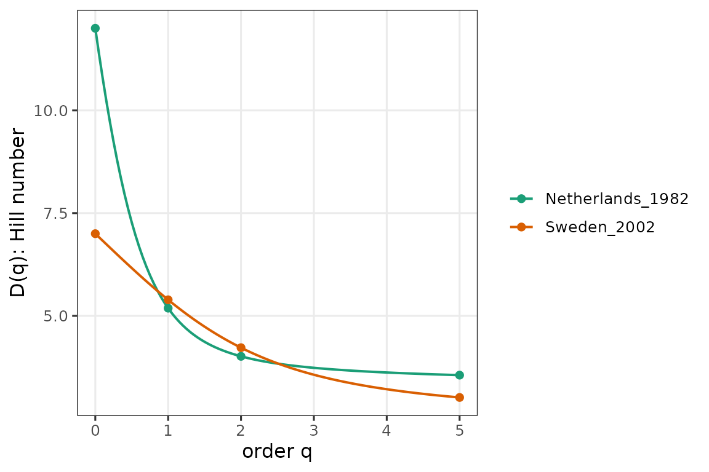
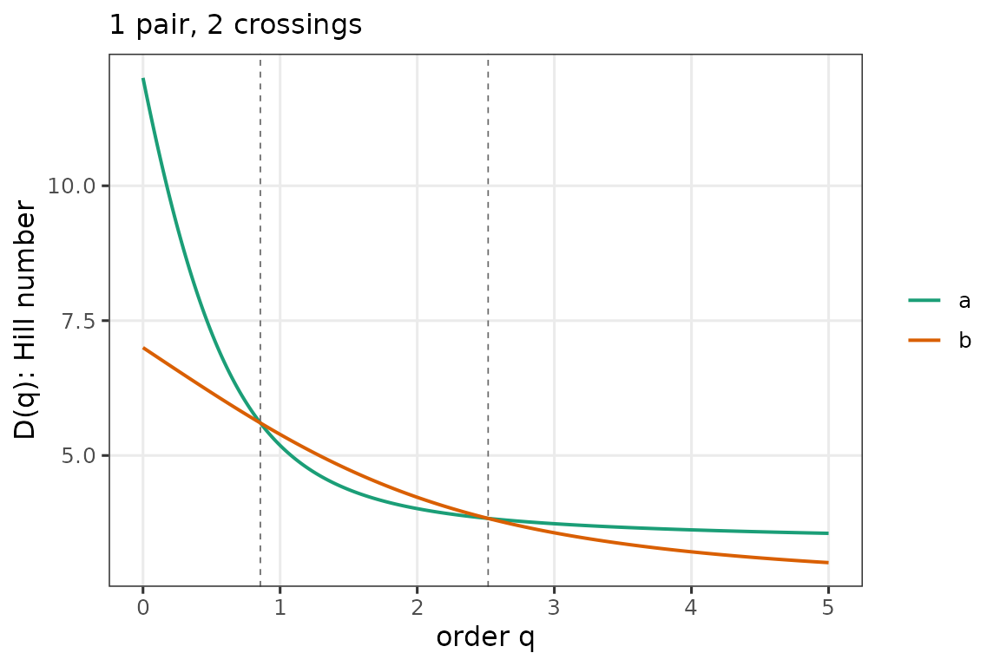
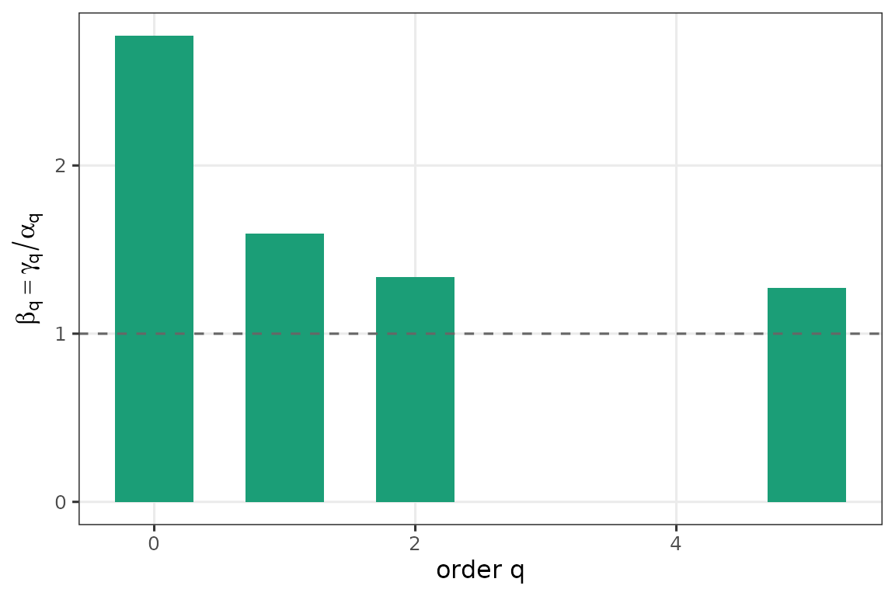

# End-to-end with ParlGov data

``` r
library(partyscape)
```

This vignette walks through the full pipeline on live
[ParlGov](https://www.parlgov.org/) data. On first run it downloads the
current `view_election` CSV and caches it in
`tools::R_user_dir("partyscape", "cache")`.

``` r
pg <- fetch_parlgov()
head(pg[, c("country", "date", "party", "seats")])
#>   country       date    party seats
#> 1     AUS 1901-03-30       PP    32
#> 2     AUS 1901-03-30      FTP    26
#> 3     AUS 1901-03-30      ALP    15
#> 4     AUS 1901-03-30     none     1
#> 5     AUS 1901-03-30 one-seat     1
#> 6     AUS 1903-12-16       PP    26
```

## Reshape to a seat-share matrix

[`parlgov_seat_shares()`](https://mneunhoe.github.io/partyscape/reference/parlgov_seat_shares.md)
produces a **party-labeled** matrix: one column per ParlGov `party_id`,
preserved across elections. Rows are country-year elections. No
row-sorting takes place; column 1 is whichever party ParlGov lists
first, not “the largest party that year.” This is what makes
[`alpha_beta_gamma()`](https://mneunhoe.github.io/partyscape/reference/alpha_beta_gamma.md)
below actually detect changes in effective power structure.

``` r
shares <- parlgov_seat_shares(pg,
                              countries = c("Netherlands", "Sweden"),
                              years     = 1960:2020,
                              type      = "parliament")
dim(shares)
#> [1] 35 44
```

## Pillar 1 — diversity profiles for a handful of elections

``` r
pick <- c("Netherlands_1982", "Sweden_2002")
plot(diversity_profile(shares[rownames(shares) %in% pick, , drop = FALSE]))
```



## Pillar 2 — crossings between the two pick elections

``` r
cr <- crossings(shares["Netherlands_1982", ],
                shares["Sweden_2002", ],
                q = seq(0, 5, 0.01))
cr
#> <crossings: 1 pair, method = interp>
#>  i j id_i id_j n_crossings   first_q
#>  1 2    a    b           2 0.8559176
plot(cr)
```



## Pillar 3 — beta diversity of one country’s trajectory

``` r
nl <- shares[attr(shares, "country") == "Netherlands", , drop = FALSE]
yr <- attr(shares, "year")[attr(shares, "country") == "Netherlands"]
plot(alpha_beta_gamma(nl, q = c(0, 1, 2, 5), years = yr))
```



## Citation

If you use ParlGov data, please cite Döring & Manow (2024), Harvard
Dataverse, DOI [10.7910/DVN/2VZ5ZC](https://doi.org/10.7910/DVN/2VZ5ZC).
