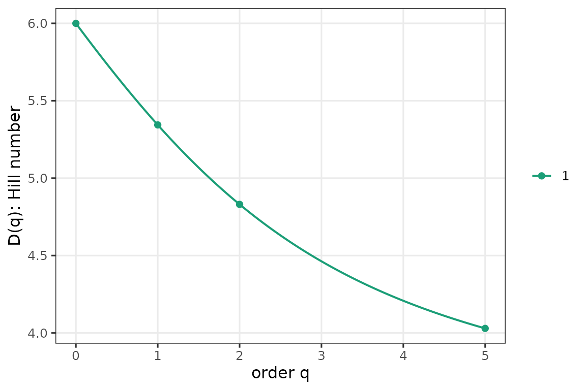
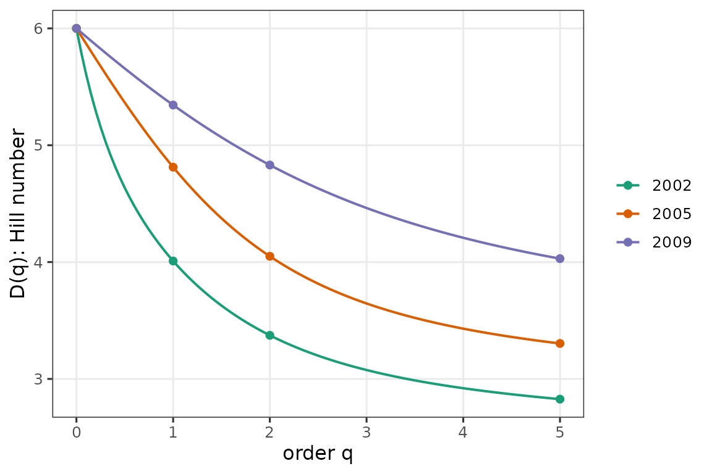
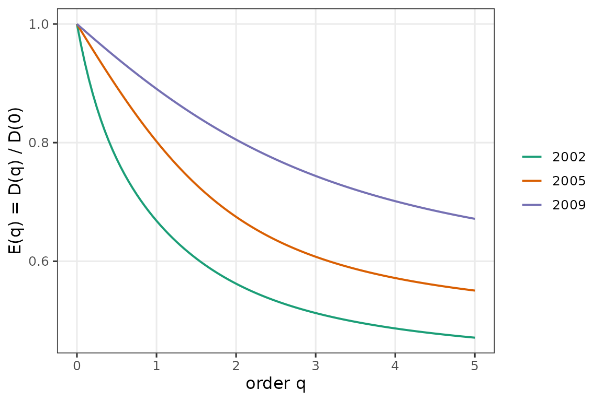
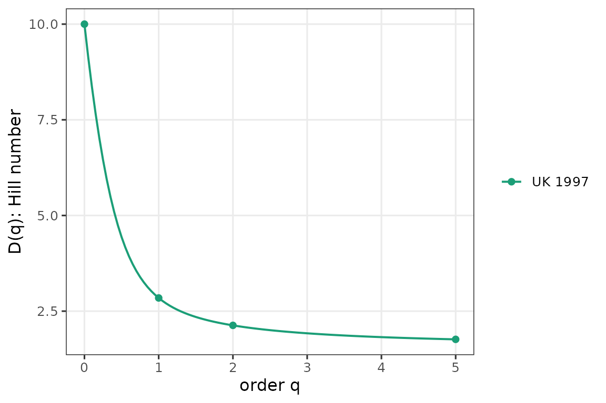
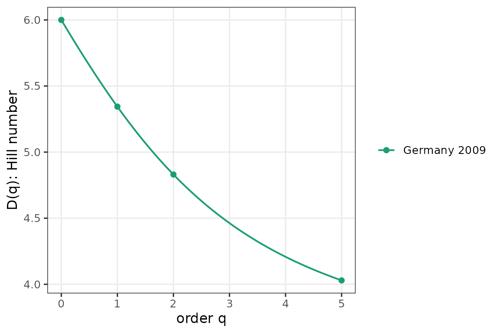

# Getting started with partyscape

``` r
library(partyscape)
```

## Party-labeled compositions

`partyscape` works on **party-labeled** compositions: each column is a
specific party, preserved across elections. The package deliberately
does *not* ask you to row-sort shares. Sorting by size makes “column 1”
mean “the largest party that year,” which loses identity information
when parties swap positions across elections — the behaviour the
package’s
[`alpha_beta_gamma()`](https://mneunhoe.github.io/partyscape/reference/alpha_beta_gamma.md)
is designed to detect.

Concretely: use named vectors (or a matrix with named columns). The
entry order reflects party identity, not rank.

``` r
germany_2009 <- c(CDU = 0.312, CSU = 0.072, SPD = 0.235,
                  FDP = 0.150, Gruene = 0.109, Linke = 0.122)

hill_number(germany_2009, c(0, 1, 2, Inf))
#> [1] 6.000000 5.343992 4.830498 3.205128
enp(germany_2009)
#> [1] 4.830498
dominance_gap(germany_2009)
#>   CDU 
#> 0.077
top_two(germany_2009)
#> [1] 0.547
```

[`diversity_profile()`](https://mneunhoe.github.io/partyscape/reference/diversity_profile.md)
sweeps q over a grid and returns an object with
[`print()`](https://rdrr.io/r/base/print.html) /
[`plot()`](https://rdrr.io/r/graphics/plot.default.html) / `autoplot()`
methods:

``` r
dp <- diversity_profile(germany_2009)
plot(dp)
```



## Several systems at once

Rows are systems, columns are parties. Column order is stable across
rows — party identity is preserved. Here are three German Bundestag
elections. Notice SPD \> CDU/CSU in 2002 and CDU/CSU \> SPD in
2005/2009: the columns are a fixed set of parties, NOT ordered by size.

``` r
germany <- rbind(
  `2002` = c(CDU = 0.315, CSU = 0.096, SPD = 0.416,
             FDP = 0.078, Gruene = 0.091, Linke = 0.003),
  `2005` = c(CDU = 0.293, CSU = 0.075, SPD = 0.362,
             FDP = 0.099, Gruene = 0.083, Linke = 0.088),
  `2009` = c(CDU = 0.312, CSU = 0.072, SPD = 0.235,
             FDP = 0.150, Gruene = 0.109, Linke = 0.122)
)
plot(diversity_profile(germany))
#> Warning: as_composition(): renormalizing rows so each sums to 1 (max deviation
#> was 0.001).
```



Evenness profile — scaled so every curve starts at 1 at q = 0:

``` r
plot(evenness_profile(germany))
#> Warning: as_composition(): renormalizing rows so each sums to 1 (max deviation
#> was 0.001).
```



## Two different-party systems

When two systems don’t share a party set (e.g., Germany and the UK),
compute each profile separately and plot them alongside each other —
padding different-length vectors with zeros would distort neither
profile but would invite the row-sorted mental model that the package
tries to avoid.

``` r
uk_1997 <- c(Labour = 0.634, Conservative = 0.250, LibDem = 0.070,
             UUP = 0.015, SNP = 0.009, PlaidCymru = 0.006,
             SDLP = 0.005, DUP = 0.003, SinnFein = 0.003,
             Independent = 0.005)
plot(diversity_profile(uk_1997,      id = "UK 1997"))
```



``` r
plot(diversity_profile(germany_2009, id = "Germany 2009"))
```



## What to read next

- [`vignette("crossings")`](https://mneunhoe.github.io/partyscape/articles/crossings.md)
  — when ENP isn’t enough.
- [`vignette("beta")`](https://mneunhoe.github.io/partyscape/articles/beta.md)
  — alpha-beta-gamma over time.
- [`vignette("parlgov")`](https://mneunhoe.github.io/partyscape/articles/parlgov.md)
  — end-to-end with live ParlGov data.
- [`vignette("replication")`](https://mneunhoe.github.io/partyscape/articles/replication.md)
  — replicate every result from the paper.
